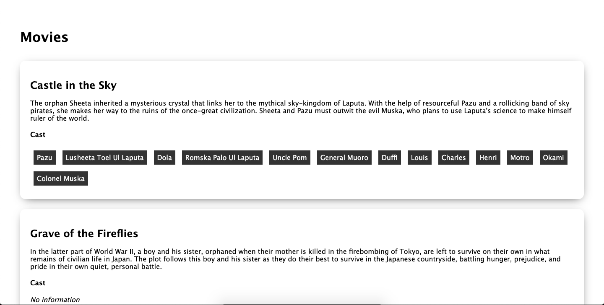

# An implementation of the Ghibli movie backend
This project implements the Ghibli API in a Django application. The API can be found at 
[https://ghibliapi.herokuapp.com/](https://ghibliapi.herokuapp.com).



# Setup
## Assumptions
- You already have python3 installed, this was developed and tested in Python 3.8.
- No pagination of any kind in the Ghibli API endpoints.

## Deployment (Unix-based system)
- Clone the project
    ```bash
    git clone https://github.com/damey2011/sennder.git
    ```
  
- Create a virtual environment wherever you want, but this shows creating it in the 
    project folder and using the [virtualenv](https://pypi.org/project/virtualenv/) 
    library.
    ```bash
    virtualenv -p python3.8 env
     ```
  This creates a new virtual environment in folder named `env`.

- Navigate inside of the project folder, activate virtual environment and install 
    requirements.
   ```bash
  source env/bin/activate
  ```
  ```bash
  pip install -r requirements.txt
  ```
  
- Run application. You may want to run with the Django embedded server in debug mode 
    or run with gunicorn.
  ```bash
  # django embedded server
  python manage.py runserver
  ```
  ```bash
  # gunicorn
  gunicorn --bind 0.0.0.0:8000 sennder.wsgi:application
  ```
- You should be able to access the application at [https://localhost:8000](https://localhost:8000).


### Docker Deployment
It is also possible to deploy to docker via [docker compose](https://docs.docker.com/compose/).
In the project root, you can run:
```bash
docker-compose up --build
```
This builds the images and creates the containers, and once this completes, you should be 
able to view the application at [https://localhost:8000](https://localhost:8000) 


## Caching
The non-dockerized setup of the application requires you to install 
[memcached](https://memcached.org) if you want to use it, but by default, the cache 
uses the local memory to temporarily persist data from the API. If you have memcached 
installed on your machine, then you can set environmental variable `USE_MEMCACHED` to `True` 
and configure location where the memcached instance runs with the `MEMCACHED_HOST` 
variable (defaults to `127.0.0.1:11211`) to use memcached as the caching backend. 
Whereas, the Docker setup uses memcached by default.